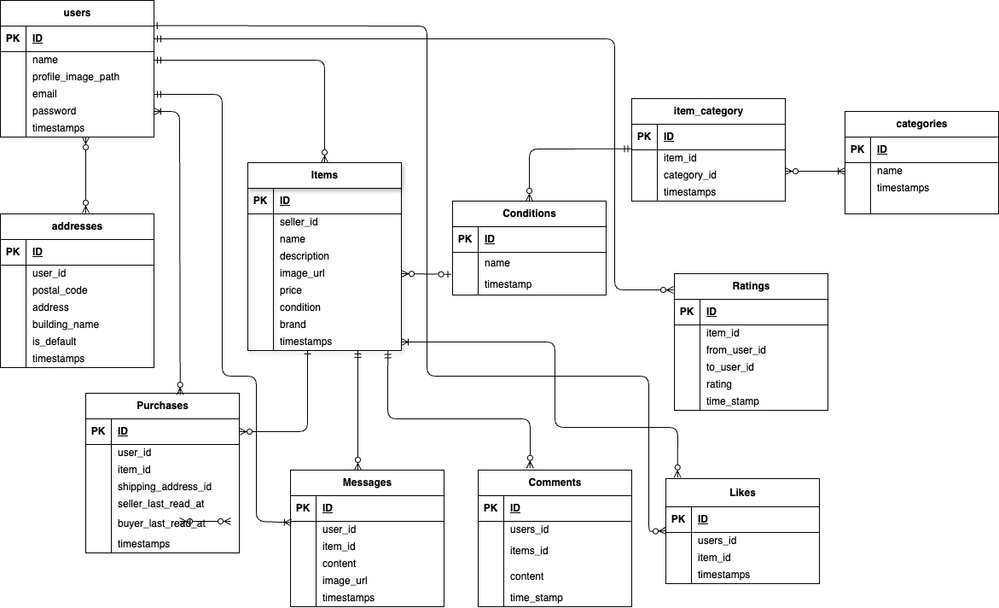

# フリマアプリ

## 環境構築

### Dockerビルド
1.  git clone [https://github.com/aya0605/mockcase-furima.git](https://github.com/aya0605/mockcase-furima.git)
2.  cd coachtech/laravel/mockcase-furima
3.  DockerDesktopアプリを立ち上げる
4.  docker-compose up -d --build
    ```yaml
    mysql:
        platform: linux/x86_64(この文追加)
        image: mysql:8.0.26
        environment:
    ```

### Laravel環境構築
1.  docker-compose exec php bash
2.  composer install
3. 「.env.example」ファイルを 「.env」ファイルに命名を変更。または、新しく.envファイルを作成
4.  .envに以下の環境変数を設定（データベース・メール設定)
    ```dotenv
    DB_CONNECTION=mysql  
    DB_HOST=mysql  
    DB_PORT=3306  
    DB_DATABASE=laravel_db  
    DB_USERNAME=laravel_user  
    DB_PASSWORD=laravel_pass  
    ```
    ```
    MAIL_MAILER=smtp
    MAIL_HOST=mailhog
    MAIL_PORT=1025
    MAIL_USERNAME=null
    MAIL_PASSWORD=null
    MAIL_ENCRYPTION=null
    MAIL_FROM_ADDRESS="admin@example.com"
    ```


5.  アプリケーションキーの作成
    ```bash
    php artisan key:generate
    ```

6.  マイグレーションの実行
    ```bash
    php artisan migrate
    ```

7.  シーディングの実行
    ```bash
    php artisan db:seed
    ```

8.  シンボリックリンク作成
    ```bash
    php artisan storage:link
    ```

## 使用技術(実行環境)

* PHP8.3.0
* Laravel8.83.27
* MySQL8.0.26

### テーブル仕様

### usersテーブル
| カラム名 | 型 | primary key | unique key | not null | foreign key |
| --- | --- | :---: | :---: | :---: | --- |
| id | bigint | ◯ | | ◯ | |
| name | varchar(255) | | | ◯ | |
| email | varchar(255) | | ◯ | ◯ | |
| password | varchar(255) | | | ◯ | |
| profile_image_path | varchar(255) | | | | |
| created_at | timestamp | | | | |
| updated_at | timestamp | | | | |

### addressesテーブル
| カラム名 | 型 | primary key | unique key | not null | foreign key |
| --- | --- | :---: | :---: | :---: | --- |
| id | bigint | ◯ | | ◯ | |
| user_id | bigint | | | ◯ | users(id) |
| postal_code | varchar(255) | | | ◯ | |
| address | varchar(255) | | | ◯ | |
| building_name | varchar(255) | | | | |
| is_default | boolean | | | ◯ | |
| created_at | timestamp | | | | |
| updated_at | timestamp | | | | |

### itemsテーブル
| カラム名 | 型 | primary key | unique key | not null | foreign key |
| --- | --- | :---: | :---: | :---: | --- |
| id | bigint | ◯ | | ◯ | |
| seller_id | bigint | | | ◯ | users(id) |
| condition_id | bigint | | | ◯ | conditions(id) |
| name | varchar(255) | | | ◯ | |
| price | int | | | ◯ | |
| brand | varchar(255) | | | | |
| description | text | | | ◯ | |
| image_url | varchar(255) | | | ◯ | |
| created_at | timestamp | | | | |
| updated_at | timestamp | | | | |

### purchasesテーブル
| カラム名 | 型 | primary key | unique key | not null | foreign key |
| --- | --- | :---: | :---: | :---: | --- |
| id | bigint | ◯ | | ◯ | |
| user_id | bigint | | | ◯ | users(id) |
| item_id | bigint | | | ◯ | items(id) |
| shipping_address_id | bigint | | | ◯ | addresses(id) |
| seller_last_read_at | timestamp | | | | |
| buyer_last_read_at | timestamp | | | | |
| created_at | timestamp | | | | |
| updated_at | timestamp | | | | |

### messagesテーブル
| カラム名 | 型 | primary key | unique key | not null | foreign key |
| --- | --- | :---: | :---: | :---: | --- |
| id | bigint | ◯ | | ◯ | |
| user_id | bigint | | | ◯ | users(id) |
| item_id | bigint | | | ◯ | items(id) |
| content | text | | | ◯ | |
| created_at | timestamp | | | | |
| updated_at | timestamp | | | | |

### conditionsテーブル
| カラム名 | 型 | primary key | unique key | not null | foreign key |
| --- | --- | :---: | :---: | :---: | --- |
| id | bigint | ◯ | | ◯ | |
| name | varchar(255) | | | ◯ | |
| created_at | timestamp | | | | |
| updated_at | timestamp | | | | |

### ER図


## テストアカウント
name: 一般ユーザ  
email: general1@gmail.com  
password: password  
-------------------------
name: 一般ユーザ  
email: general2@gmail.com  
password: password  
-------------------------
name: テストユーザ  
email: test@example.com  
password: password  
-------------------------

## URL
* **開発環境**： (http://localhost/)
* **phpMyAdmin**:  (http://localhost:8080/)
* **Mailhog(メール確認)**: http://localhost:8025/


